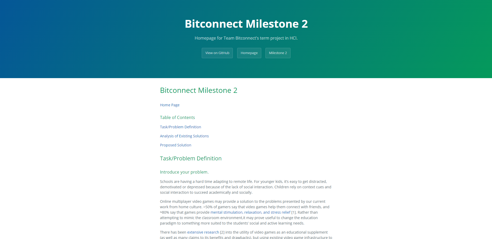

# Bitconnect Milestone 2

#### [Home Page](README.md)

### Table of Contents

[Task/Problem Definition](#taskproblem-definition)

[Analysis of Existing Solutions](#analysis-of-existing-solutions)

[Proposed Solution](#proposed-solution)

## Task/Problem Definition

### Introduce your problem.

Schools are having a hard time adapting to remote life. For younger kids, it's easy to get distracted, demotivated or depressed because of the lack of social interaction. Children rely on context cues and social interaction to succeed academically and socially. 

Online multiplayer video games may provide a solution to the problems presented by our current work from home culture. >50% of gamers say that video games help them connect with friends, and ≈80% say that games provide [mental stimulation, relaxation, and stress relief](#1) [1]. Rather than attempting to mimic the classroom environment,it may prove useful to change the education paradigm to something more suited to the students’ social and active learning needs. 

There has been [extensive research](#2) [2] into the utility of video games as an educational supplement (as well as many claims to its benefits and drawbacks), but using existing video game infrastructure to facilitate teaching in a social environment may strike a more healthy balance between education and socialization remotely. For example, [Minecraft: Education Edition](#3) [3] uses a popular existing game (minecraft) to aid STEM teachers, rather than attempt to replace them.

*Figure 1: [The seven stages of action](#17) [17].*

A typical interaction starts when a student forms a goal (or is given a goal) to learn about a concept, attend an online class, or present to others. That goal can be planned, guided, and constrained by an instructor or planned by the student him or herself. For instance, a student may be constrained to use a particular platform, or he or she can choose a platform amongst the available options. After planning and specifying, the student starts executing the goal which may involve passive/active learning or interacting with others. 

Although the learning process may seem simple on a conceptual level (encounter material -> learn material -> prove comprehension via test or presentation) , there can be gulfs of execution or evaluation from the student's perspective. Interacting with online learning management systems or virtual class environments can prove challenging for various reasons:

- signifiers may be different between programs: the same desired goal may have entirely different courses of action to achieve it based on which platform the student is using.
- Automated feecback may be inaccurate/irrelevant. Automatically graded math problems exhibit this behavior especially. A common greivance among students is when the system marks their answer as incorrect due to negligible formatting errors (ex. `1 + 2` vs. `(1 + 2)`, `-1` vs. `- 1`, `0.75` vs. `.75` etc.), or the students (correct) derivation is formatted differently from the "correct" solution.
- Because online learning systems often need to facilitate social discussion, each student must gague not only the current state of the system, but also the real-time changes to the system input from other students. One example  of this problem is accidentally replying to the wrong prompt because forum posts were updating in real time causing the student's screen to shift. Another example is simply not being able to follow the flow of the discussion because of the amount of students posting/replying on a forum.

### Identify your potential users.

The user population most affected by our problem of study are younger students. They must continue their education despite not being in the classroom, so they have to attend virtual class and have to learn the material in a completely new and different way than they are used to, along with not being able to interact with other students in the process. While learning from home, students have more distractions present around them than they would have in a normal classroom setting. The benefit of a solution to this problem is that the students would be able to learn and retain information nearly as well as they would in the classroom, and they would be able to still have the social interactions they would receive in a real-life setting.

## Analysis of Existing Solutions

### Describe existing solutions.

To address the prompt, we first discuss a related learning theory, and then we describe three solutions that attempt to solve the problem, perhaps by enhancing the learning process and promoting factors, such as learners’ motivation, engagement, and socialization. Learning is multifaceted, and there are multiple learning theories, such as the behavioral and cognitivist theories, that explain processes and [sequence of learning](#4) [4]. For instance, in the cognitivist learning theories, the learning process is centered around the internal processes a learner undertakes to process and retain information. The learning in this theory is not a stimuli-response sequence, but a formation of [cognitive structure](#15) [15]. In cognitivist theories, learners learn through mental processes, and the learning involves behavioral change that occurs over time through a series of experiences. For instance, learning a new language occurs over time through experiences where learners interact with others to learn how to produce a [word or a sound](#4) [4]. The learning theories acknowledge the importance of factors related to learning, such as learners’ motivation, engagement, and self-efficacy. To acknowledge these factors, Prensky believes that the [motivation leads to successful learning](#5) [5]. He discusses that content in schools, colleges, and in any other learning environments may be dry and not interesting enough for the learners. That impacts the knowledge attainment and retention among learners. Prensky also discusses that video games keep learners engaged and motivated, and their attitude toward video games is different than their attitude toward school. In addition to the motivation factor, the social factor plays a major role in learning where learners usually learn in a social context and are influenced by others. The social cognitive theory discusses the interaction between learners, their behaviors, and the surrounding environment.

**Minecraft Education**

Minecraft Education is a digital game-based learning that engages learners to solve problems, learn about new concepts, and interact with others in a [virtual world made of blocks](#6) [6]. Minecraft Education contains designed lessons and functionalities for educators and learners. For instance, players can use the code builder to learn about programming concepts, such as loops, in a context of adding dolphins to an aquarium. Minecraft Education facilitates social and emotional interaction between players. Such a game also provides a venue for social interactions among players beyond the face-to-face interaction which may be challenging for some individuals, [such as individuals with autism](#7) [7].

*Figure 2: [An illustration of the Minecraft code builder which allows players to learn coding](#8) [8].*

**Crystal Island**

Crystal Island provides a narrative-centered learning environment that engages students in [story-based interactive experiences](#9) [9]. It combines and uses commercial video games, intelligent tutoring systems, and narratives. The story-based narratives provide and open new opportunities for learning by increasing learners’ motivation and engagement. The narratives support and facilitate encoding of information in the episodic memories. The narrative-centered environment also facilitates social and emotional interaction. Crystal Island involves a science mystery narrative-based learning environment that engages students to explore a solution to an infectious disease on an island.

*Figure 3: [An illustration of the Crystal Island interaction component. Here is a fictional character with which students can interact in a problem solving task](#8) [8].*

**Structuring Synchronous Interactions**

In addition to the previous two examples, there is also recent research on how to structure peer interactions on large-scale online learning systems. [Coetzee et al](#10) [10] believe that Massive Open Online Courses (MOOCs) lack a social component where it is hard for students to reach out and interact with instructors of the online courses. Such learning systems lack the support for students to collaborate with each other to explore concepts or understand topics with their peers. Although such systems have online forums enabling questions and answering, they suffer from retaining students over time. Students are better situated to interact and learn from each other in an environment that facilitates peer learning. Coetzee et al mentioned that recent research proposed peer grading where students review each other's work. However, this process is anonymous and asynchronous where students do not have opportunities to interact with others. To mitigate this, Coetzee et al introduced a new design of structured chat rooms where learners can work together to discuss and solve some problems related to learning materials. Figure 3 shows a snippet of the structured form of interaction. 

 *Figure 4: [An illustration of a structured form of interactions of a group of students collaborating to solve an experience](#8) [8].*

### Describe potential guidelines and solutions.

Each of the above solutions adhere to the following Section 508 Standards: “Procure & Develop Accessible Technology”, “Practice Universal Design”, and “Measure & Monitor Progress”. For example, Minecraft Education controls are simple and easy to pick up because it was designed to be accessible for both younger audiences as well as the teachers. The pre-existing lectures in Minecraft Education make it easy for teachers to guide students along the course without creating a lecture and “world” from scratch. The purposeful simplicity of Minecraft’s design follows universal design guidelines as well as universal usability principles. Furthermore, the ability to take on a creator role in the Minecraft world is appealing to students, especially as feedback from the game is intriguing and immediate to users. Feedback of progress is given to the user in the form of interactive structures, objects, or any type of communication from teachers or fellow students. This follows the “measure & monitor progress” guideline and the “user in control” principle. In recent years, updates have been made to include Microsoft’s “Immersive Reader” in Minecraft -- the extension helps break up pages into visual components, slow down text, or read text aloud to users. There have also been breakthroughs in fostering text-based communication among students in the [autism spectrum](#16) [16]. Therefore, these solutions conform to accessible technology standards as well. These inclusive updates are important because web-based games have been found to significantly foster engagement, motivation, and [comprehension among special needs students in particular](#13) [13]. Overall, the same guidelines and principles of the above pre-existing solutions apply to our target users as well.

Due to the age group of our users (<18 years old), it is important to keep in mind the individual needs and ability of each student. It has been found that the average student’s attention span within a physical classroom is roughly 7-10 minutes long and reduces to [8 seconds during online learning](#14) [14]. Due to the variability of each individual student’s attention span and technical skillset, information must be fully digestible in order to avoid overloading students' short-term memory load. In addition, our solution must be universally accessible for both student and teacher roles to facilitate ease of use. And while our target group does not explicitly include special needs students, our solution should conform to accessible technology standards in order to foster an inclusive environment and interface. Again, our users should feel engaged with the platform through principles such as appropriate progress monitoring and feedback, digestible content, and usability. As well, the Section 508 Standards: “Procure & Develop Accessible Technology”, “Practice Universal Design”, and “Measure & Monitor Progress” must be adhered to properly serve our target user group. To add, technical roadblocks, such as inconsistent interfacing, lack of control/information, and general bugs or errors, should be avoided whenever possible in order to avoid frustration and subsequent rejection of our platform. In conclusion, our target user group should feel appropriately in control of the “game” and learning should be encouraged through meaningful, consistent interactions.

## Proposed Solution

### Propose a solution.

We propose a virtual classroom environment system built on top of popular, moddable video games. Existing video games are familiar to kids, well designed, and often have dedicated communities to supporting modification and extension. While existing solutions are readily available, and there has been extensive research into the topic of virtual education, the use of existing multiplayer games in the classroom is a solution that could potentially provide a compromise between in-person education and virtual education.

The three main goals of this solution are to reduce anxiety, foster a social environment, and engage students in an interactive virtual environment.

**Reduce anxiety**

- Talking to a zoom/skype call can be difficult for children. Instead of speaking out into the void, or replying to an anonymous forum post from a classmate, giving students the opportunity to interact with personified avatars will give them more social feedback.
- Virtual avatars reduce student’s self consciousness. 
- Video games are a familiar environment/ home turf for kids. As stated earlier, many children are familiar with popular online video games such as Minecraft, Fortnite, or Roblox,  and are already familiar with the world-interaction systems. Rather than expending resources teaching students how to use online forum platforms, it may be advantageous to change how we view the classroom and provide an unorthodox solution to the virtual education/interaction problem.

**Foster a social environment**

- There are some major pitfalls in integrating socialization into distributed learning environments. 

- > “According to Kearsley (1995), social interaction in CSCL environments must be organized or it is unlikely to occur or be meaningful. Liaw and Huang (2000) and Northrup (2001) determined that in a learning environment, interaction does not just happen, but must be intentionally designed into the instruction. If we discount the problem that most educators do not know what they have to do in order to encourage social interaction (Kearsley, 1995; Rourke, 2000a), what remains is the observation that a majority of educators—consciously or unconsciously—takes social interaction for granted. They think that because in face-to-face learning groups social interaction is ‘easy’ to achieve if not already there, the same patterns will be encountered in distributed learning groups. Rourke (2000b), however, concluded that social interaction can no more be taken for granted in computer conferences than it can be in face-to-face settings such as lecture halls or small seminar settings.” [Kearsly, et. al](#12) [12]

- Zoom calls and other online forum **interfaces** afford students the ability to interact, but responding to a discussion post doesn’t provide students with the same level of interpersonal skill exercise.

**Engage students in an interactive virtual environment**

- Many students have experienced the use of distributed systems to help facilitate group work (such as class forums, online learning systems, etc), but the inherit focus on the platform instead of the students may leave many students at a disadvantage. Existing solutions may signify dedicated "social" pages/areas, but often they simply define a virtual space as "social" without focusing on the actual interaction between students.

- > “Just putting a forum in a group and labeling it 'cafe' or 'lobby' does not increase interaction. It is more important to focus on the actors or agents (group members, instructors, and content) who are to be involved in the social interaction and their needs.” [Kearsly, et. al](#12) [12]

- The interactive virtual environment will provide students the opportunity to interact with the material, other students, and the teacher in a capacity that existing distributed learning systems cannot.

### How will you measure success?

As for methods to determine the effectiveness of our solution, there is no way to do that without actual interaction with our user group. We cannot use mathematical analysis to make our usage more efficient, or any tool to measure the efficiency like a clock. We must collect data directly from users. As for how we do that, there are two possibilities:

**Method One: Experiment**

A more refined way to collect this data would be to design a somewhat rigorous experiment, comparing the effectiveness of our solution to the lack of our solution. We could also include other control groups to test existing solutions. We would need to find an objective measure to compare the effectiveness of an education tool in the generation of memory retention and measure “learning”. The most obvious way to measure this is by measuring the grade point average of students using our solution, using other solutions, and using no solution, but grade averages are not a totally objective measure; many factors can change grades of individual or groups of students.

**Method Two: Survey**

Another way to measure success would be to have students use our solution, then provide a survey. The largest issue with this is that it would only measure how students feel about how well they learned, but these reports could be misleading or wrong. Students may feel they learned better than they did, or they may find themselves bored of a game in an education environment and feel that it was useless while in fact it was still quite helpful. This could be mitigated by using a more intricately designed survey such as the [Activity Engagement Survey](#11) [11] to generate more meaningful data.

## Credits

- Nathan: [Introduce the Problem](#introduce-your-problem), [Proposed Solution](#propose-a-solution)
- Kathy: [Describe Potential Guidelines and Solutions](#describe-potential-guidelines-and-solutions)
- Christian: [Identify Potential Users](#identify-your-potential-users)
- Alex: [How Will You Measure Success?](#how-will-you-measure-success)
- Mohammed: [Describe Existing Solutions](#describe-existing-solutions)

## References

#### [1]

2020 Essential Facts About the Video Game Industry. (2020, July 28). Retrieved October 04, 2020, from https://www.theesa.com/esa-research/2020-essential-facts-about-the-video-game-industry/

#### [2]

 Mitchell, A., & Savill-Smith, C. (n.d.). The use of computer and video games for learning. Retrieved from https://dera.ioe.ac.uk/5270/7/041529_Redacted.pdf

#### [3]

 Homepage: Minecraft: Education Edition. (2020, October 03). Retrieved October 04, 2020, from https://education.minecraft.net/

#### [4]

 Schunk, D. H. (1996). Learning theories. Printice Hall Inc., New Jersey, 53.

#### [5]

Prensky, M. (2003). Digital game-based learning. Computers in Entertainment (CIE), 1(1), 21-21.

#### [6]

Bar-El, D., & E. Ringland, K. (2020, September). Crafting Game-Based Learning: An Analysis of Lessons for Minecraft Education Edition. In International Conference on the Foundations of Digital Games (pp. 1-4).

#### [7]

Ringland, K. E., Wolf, C. T., Faucett, H., Dombrowski, L., & Hayes, G. R. (2016, May). " Will I always be not social?" Re-Conceptualizing Sociality in the Context of a Minecraft Community for Autism. In Proceedings of the 2016 CHI Conference on Human Factors in Computing Systems (pp. 1256-1269).

#### [8]

What’s New in EDU: Minecraft: Education Edition gets Code Builder and launches new Hour of Code. (2018, November 15). Retrieved September 26, 2020, from https://educationblog.microsoft.com/en-us/2018/11/whats-new-in-edu-minecraft-hour-of-code/ 

#### [9]

Rowe, J., Mott, B., McQuiggan, S., Robison, J., Lee, S., & Lester, J. (2009). Crystal island: A narrative-centered learning environment for eighth grade microbiology. In workshop on intelligent educational games at the 14th international conference on artificial intelligence in education, Brighton, UK (pp. 11-20).

#### [10]

Coetzee, D., Lim, S., Fox, A., Hartmann, B., & Hearst, M. A. (2015, February). Structuring interactions for large-scale synchronous peer learning. In Proceedings of the 18th ACM Conference on Computer Supported Cooperative Work & Social Computing (pp. 1139-1152).

#### [11]

Ben-Eliyahu, A., Moore, D., Dorph, R., & Schunn, C. D. (2018). Investigating the multidimensionality of engagement: Affective, behavioral, and cognitive engagement across science activities and contexts. Contemporary Educational Psychology, 53, 87-105.

#### [12]

Kreijns, K., Kirschner, P. A., & Jochems, W. (2003). Identifying the pitfalls for social interaction in computer-supported collaborative learning environments: a review of the research. Computers in human behavior, 19(3), 335-353.

#### [13]

García-Redondo, P., García, T., Areces, D., Núñez, J., & Rodríguez, C. (2019, July 11). Serious Games and Their Effect Improving Attention in Students with Learning Disabilities. Retrieved October 04, 2020, from https://www.ncbi.nlm.nih.gov/pmc/articles/PMC6679141/

#### [14]

Rothman, D. (2020). A Tsunami of Learners Called Generation Z. Retrieved October 04, 2020, from https://mdle.net/journal/A_Tsunami_of_Learners_Called_Generation_Z.pdf

#### [15]

Jo Harris. (2014, February 24). A Brief Overview of 4 Learning Theories [Video]:. YouTube. https://www.youtube.com/watch?v=ACowHxGEAUg&t=9s&ab_channel=JoHarris 

#### [16]

Huang, M. (2019, October 29). Minecraft now more autism friendly with accessibility features built by Garage Interns. Retrieved October 04, 2020, from https://www.microsoft.com/en-us/garage/blog/2019/10/minecraft-now-more-autism-friendly-with-accessibility-features-built-by-garage-interns/

#### [17]

Norman, D. A. (1988). The psychology of everyday things. Basic books.

